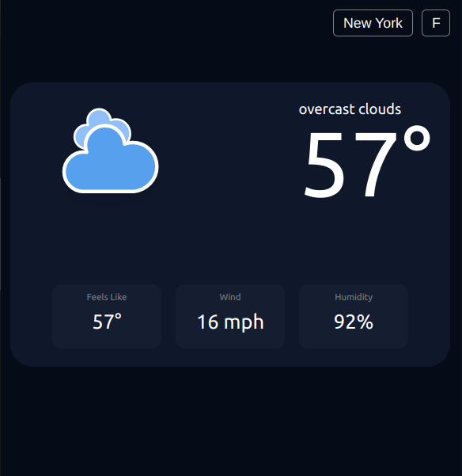

# Weather App v2

## [Live Demo](https://sykoivisto.github.io/weather-app-v2/)

## Description

I build this app to practice using asynchronous functions, es6 modules, imports, webpack, and more. This was a good exercise in getting a few async functions to work together correctly, and dynamically displaying content to the DOM; while keeping the code clean and bundling everything nicely.

In addition, I also practiced some basic node.js/ express app setup by setting up an API proxy to hide my API key. Although not exactly necessary here, it's a good practice and I learned a lot by accomplishing that. The source for that is in [this repo](https://github.com/sykoivisto/weather-app-api-proxy).

Keep in mind the API proxy is hosted on a free package on [render.com](https://render.com/), so response time may be a little slow- especially for the first call.

## Credits

The icons I used for this project come from [Makin-Things](https://github.com/Makin-Things/weather-icons) here on GitHub.

Thank you to [Open Weather Map](https://openweathermap.org/) for developing such a powerful API, and allowing people like me to use it for free.

I made this repo as a project for part of [The Odin Project](https://www.theodinproject.com/) curriculum.

  
  
  
